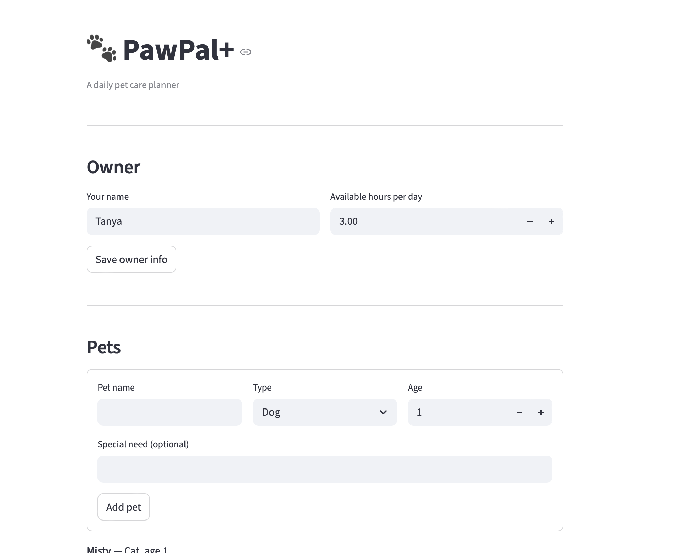
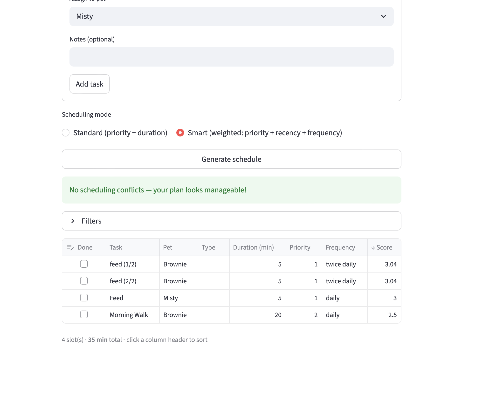

# PawPal+ (Module 2 Project)

PawPal+ is a Streamlit-based pet care planner that helps an owner manage multiple pets, track recurring care tasks, and generate a daily schedule that respects availability and task urgency.

## Features

- **Owner profile and availability**
  - Save owner name and daily availability
  - Available time is entered in the UI as a numeric `Available hours per day` value
  - The backend also supports direct budget formats like `8h`, `8 hours`, or `480 min`
- **Pet management**
  - Add and list pets with type, age, and special needs
- **Task creation and recurrence**
  - Add tasks with title, type, duration, priority, frequency, and optional notes
  - Supported frequencies: `DAILY`, `TWICE_DAILY`, `WEEKLY`, and `AS_NEEDED`
- **Daily schedule generation**
  - Build a plan from active tasks and recurrence rules
  - `TWICE_DAILY` tasks appear twice until both slots are completed
  - `WEEKLY` tasks are suppressed for seven days after completion
- **Priority-based ordering**
  - Standard mode sorts tasks by priority and then by duration
  - Shorter, high-priority tasks are surfaced earlier in the schedule
- **Smart scheduling**
  - Smart mode calculates a weighted urgency score based on:
    - base priority (50%)
    - days since last completion (30%)
    - task frequency (20%)
- **Conflict warnings**
  - Detects when the total daily task duration exceeds the owner's available minutes
  - Provides clear warnings with total scheduled time, available budget, and example clashing tasks
- **Interactive filters and completion tracking**
  - Filter the plan by pet, maximum task duration, and priority
  - Mark tasks done directly in the schedule table
  - Completed tasks are removed from today’s plan and will reappear depending on frequency

## Installation

```bash
python -m venv .venv
source .venv/bin/activate
pip install -r requirements.txt
```

## Running the app

```bash
# Run the CLI demo
python main.py

# Run the Streamlit web UI
streamlit run app.py
```

## How it works

### Availability parsing

The Streamlit UI captures availability as a numeric hours-per-day value and stores it as an hourly budget (for example, `8h`). The backend also accepts direct text values for debugging or future input formats, including:

- `8h`, `8 hours`
- `480 min`, `480 minutes`

This budget is used to detect overloaded schedules and produce conflict warnings.

### Schedule generation

The daily plan is built from the owner's pet tasks using these rules:

- `TWICE_DAILY`: two slots per day until both are completed
- `DAILY`: one slot per day unless already completed today
- `WEEKLY`: suppressed for seven days after completion
- `AS_NEEDED`: appears once in the plan

Standard mode sorts the plan by priority and duration.

### Smart scheduling

Smart mode uses a composite urgency score to rank tasks. The score combines:

- task priority (primary urgency)
- recency since last completion
- frequency type

This helps balance routine jobs and time-sensitive care.

### Conflict detection

The scheduler compares the total daily task duration for the generated plan with the owner’s available minutes. If the plan exceeds the budget, PawPal+ generates a warning message that highlights:

- total scheduled minutes
- available minutes
- example task collision candidates

## Testing

Run the unit tests with:

```bash
python -m pytest
```

### Test coverage

The suite verifies:

- task creation and recurrence behavior
- daily plan generation and sort order
- `DAILY`, `TWICE_DAILY`, `WEEKLY`, and `AS_NEEDED` frequency handling
- availability parsing and conflict detection logic
- smart urgency scoring
- edge cases such as no pets or no tasks

## Notes

- The app persists owner, pet, and plan state in Streamlit session state.
- The Streamlit UI provides forms for pets, tasks, and plan generation.
- This implementation emphasizes daily planning and availability-aware scheduling rather than calendar-level event management.

## 📸 Demo

- 
- 